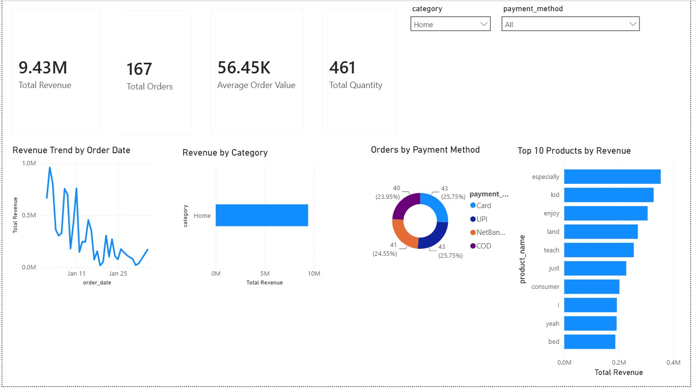
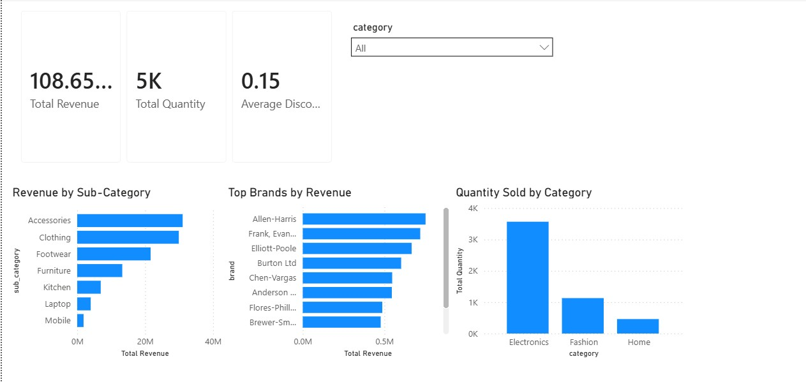
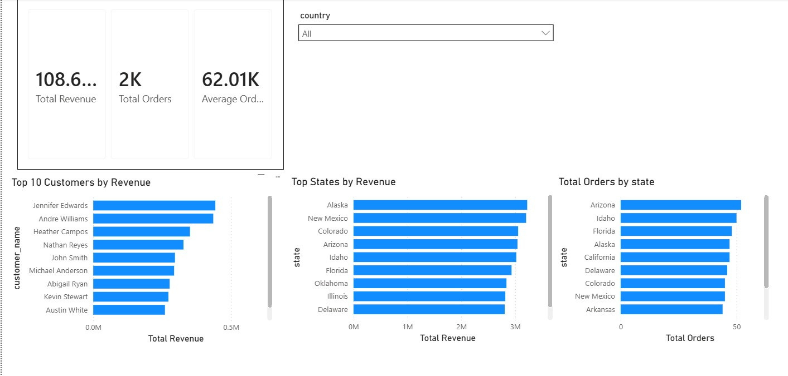
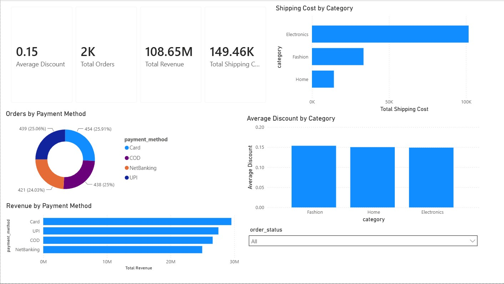

# E-commerce Sales ETL/ELT Analytics Project

## Project Overview

This project is an end-to-end analytics portfolio project built with a Kaggle e-commerce sales dataset. The goal is to demonstrate a practical analytics workflow: loading raw transactional data, validating data quality, transforming it into a simple star schema, writing SQL analytics queries, and building an interactive Power BI dashboard.

The project uses a synthetic Amazon-style e-commerce dataset, so the focus is on analytics engineering practice rather than real company performance claims.

## Tools Used

- Python
- pandas
- SQLAlchemy
- PyMySQL / MySQL Connector
- MySQL
- SQL
- Power BI
- Git / GitHub

## Dataset

Source: Kaggle E-commerce Sales Dataset

Raw file location after download:

```text
data/raw/amazon_sales_dataset.csv
```

Note: The raw CSV file is not committed to this repository. Download it from Kaggle and place it under `data/raw/`.

Initial dataset profile:

- Rows: 10,000
- Columns: 21
- Unique orders: 10,000
- Unique customers: 6,016
- Unique products: 900
- Main categories: Home, Electronics, Fashion

Main fields include:

- Order details: `order_id`, `order_date`, `ship_date`, `delivery_date`, `order_status`
- Customer details: `customer_id`, `customer_name`, `country`, `state`, `city`
- Product details: `product_id`, `product_name`, `category`, `sub_category`, `brand`
- Sales metrics: `quantity`, `unit_price`, `discount`, `shipping_cost`, `total_sales`
- Payment details: `payment_method`

## Project Architecture

```text
CSV file
  -> Python / pandas load process
  -> MySQL raw table: raw_orders
  -> SQL staging view: stg_valid_orders
  -> Star schema tables
       - dim_customers
       - dim_products
       - fact_orders
  -> SQL analytics queries
  -> Power BI dashboard
```

## ETL / ELT Workflow

This project combines both ETL and ELT concepts.

The raw CSV is loaded into MySQL as `raw_orders`. Then SQL is used inside the database to filter valid records and create analytics-ready dimension and fact tables.

Main database objects:

- `raw_orders`: raw imported transactional data
- `stg_valid_orders`: staging view with valid order, shipping, and delivery date sequences
- `dim_customers`: customer dimension table
- `dim_products`: product dimension table
- `fact_orders`: order-level fact table

## Data Quality Checks

During exploration, the dataset had no null values and no duplicated full rows. However, some records had invalid date sequences:

- `ship_date < order_date`
- `delivery_date < ship_date`

To keep the analytics model reliable, only valid records are included in the staging layer:

```sql
CREATE OR REPLACE VIEW stg_valid_orders AS
SELECT *
FROM raw_orders
WHERE ship_date >= order_date
  AND delivery_date >= ship_date;
```

After this validation step, `stg_valid_orders` contains 1,752 valid records.

Dimension uniqueness checks:

```sql
SELECT COUNT(*) AS rows_count, COUNT(DISTINCT customer_id) AS unique_customers
FROM dim_customers;

SELECT COUNT(*) AS rows_count, COUNT(DISTINCT product_id) AS unique_products
FROM dim_products;
```

Expected result: row count and distinct count should match for each dimension table.

## Database Schema

### dim_customers

- `customer_id`
- `customer_name`
- `country`
- `state`
- `city`

### dim_products

- `product_id`
- `product_name`
- `category`
- `sub_category`
- `brand`

### fact_orders

- `order_id`
- `customer_id`
- `product_id`
- `order_date`
- `ship_date`
- `delivery_date`
- `order_status`
- `payment_method`
- `quantity`
- `unit_price`
- `discount`
- `shipping_cost`
- `total_sales`

## Power BI Dashboard

The Power BI report contains four pages:

1. Executive Overview
   - Total revenue
   - Total orders
   - Average order value
   - Total quantity sold
   - Revenue trend by order date
   - Revenue by category
   - Orders by payment method
   - Top 10 products by revenue

2. Product Analysis
   - Revenue by sub-category
   - Top brands by revenue
   - Quantity sold by category
   - Category slicer

3. Customer Analysis
   - Top 10 customers by revenue
   - Revenue by state
   - Total orders by state
   - Country slicer

4. Operations Analysis
   - Orders by status
   - Revenue by payment method
   - Shipping cost by category
   - Average discount by category
   - Order status slicer

Power BI model relationships:

```text
dim_customers[customer_id] 1 -> * fact_orders[customer_id]
dim_products[product_id]  1 -> * fact_orders[product_id]
```

Core DAX measures:

```DAX
Total Revenue = SUM('ecommerce_dw fact_orders'[total_sales])
Total Orders = DISTINCTCOUNT('ecommerce_dw fact_orders'[order_id])
Total Quantity = SUM('ecommerce_dw fact_orders'[quantity])
Average Order Value = DIVIDE([Total Revenue], [Total Orders])
Total Shipping Cost = SUM('ecommerce_dw fact_orders'[shipping_cost])
Average Discount = AVERAGE('ecommerce_dw fact_orders'[discount])
```

## Dashboard Preview

### Executive Overview



### Product Analysis



### Customer Analysis



### Operations Analysis



## SQL Analytics Examples

The SQL layer includes queries for:

- Revenue by category
- Top 10 products by revenue
- Top 10 customers by revenue
- Payment method distribution
- Monthly revenue trend

See:

```text
sql/06_analytics_queries.sql
```

## How to Run

1. Clone the repository.
2. Install Python dependencies:

```bash
pip install -r requirements.txt
```

3. Create the MySQL database:

```sql
CREATE DATABASE IF NOT EXISTS ecommerce_dw;
USE ecommerce_dw;
```

4. Create a local `.env` file from `.env.example`, then load the raw CSV into MySQL:

```bash
python pipelines/etl_python/load_raw_to_mysql.py
```

5. Run the SQL scripts in order:

```text
sql/01_database_setup.sql
sql/02_staging_layer.sql
sql/03_dimensions.sql
sql/04_fact_table.sql
sql/05_quality_checks.sql
sql/06_analytics_queries.sql
```

6. Open the Power BI file from the `powerbi/` folder and refresh the MySQL connection.

## Repository Structure

```text
ecommerce-sales-etl-elt-analytics/
|-- data/
|   `-- raw/
|       `-- place amazon_sales_dataset.csv here (not committed)
|-- docs/
|   `-- images/
|-- notebooks/
|-- pipelines/
|   `-- etl_python/
|       `-- load_raw_to_mysql.py
|-- powerbi/
|   `-- ecommerce_sales_dashboard.pbix
|-- sql/
|   |-- 01_database_setup.sql
|   |-- 02_staging_layer.sql
|   |-- 03_dimensions.sql
|   |-- 04_fact_table.sql
|   |-- 05_quality_checks.sql
|   `-- 06_analytics_queries.sql
|-- .env.example
|-- .gitignore
|-- README.md
`-- requirements.txt
```

## Future Improvements

- Add a dedicated date dimension table
- Add dbt-style SQL transformations
- Add more detailed customer segmentation
- Add delivery time analysis using `order_date`, `ship_date`, and `delivery_date`
- Add automated tests for data quality checks

## Security Note

Database passwords and local connection details should not be committed to GitHub. Use environment variables or a `.env` file excluded by `.gitignore`.
